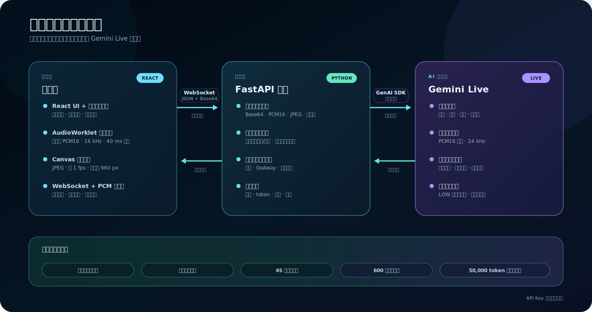

<h1 align="center"> EchoSight </h1>

<h3 align="center">让 AI 实时看见、听见并回应你所处的世界</h3>

<p align="center">基于 Gemini Live 的实时多模态视觉语音助手。</p>

<p align="center">面向持续变化的真实环境，让摄像头、语音和文字共享同一个对话上下文。</p>

<p align="center">
  <a href="https://github.com/0xXu"><strong>演示视频</strong></a>
  ·
  <a href="./docs/DESIGN.md"><strong>设计文档</strong></a>
</p>

<p align="center">
  
  
  
  
</p>

<p align="center">
  <a href="#演示">演示</a>
  ·
  <a href="#功能说明">功能说明</a>
  ·
  <a href="#系统架构">系统架构</a>
  ·
  <a href="#本地运行">本地运行</a>
  ·
  <a href="#项目结构">项目结构</a>
</p>

---

## 演示

- **演示视频（占位）**：[https://github.com/0xXu](https://github.com/0xXu)
- **设计文档**：[docs/DESIGN.md](./docs/DESIGN.md)

> 当前链接暂作演示视频占位，正式视频发布后将替换。

---

## 功能说明

> “镜头里有什么？下一步应该怎么操作？”

一次实时会话同时处理：

1. **摄像头画面**：浏览器将画面缩放、压缩为低帧率 JPEG，只发送最新且有效的帧。
2. **麦克风音频**：通过 AudioWorklet 采集音频，重采样为 16 kHz PCM16 并持续发送。
3. **文字提问**：用户可在完整对话记录中直接输入文字问题。
4. **Gemini Live**：结合视觉、语音和上下文生成实时回答。
5. **语音播放**：浏览器按顺序播放 24 kHz PCM16 模型语音。
6. **实时转写**：同时展示用户语音转写和 AI 输出转写。
7. **用户打断**：用户说话打断 AI 时，立即停止并清空旧的播放队列。
8. **会话摘要**：结束后展示时长、首响应延迟、token 和视频帧统计。

会话保持连续，不需要为每次追问重新上传图片或创建新的请求。

---

## 系统架构



浏览器负责设备访问、媒体编码、状态展示和音频播放；FastAPI 后端负责协议校验、有界调度、会话限制、用量统计和 Gemini 连接。所有浏览器输入都通过 WebSocket 发送到后端，API Key 不会进入前端代码或浏览器存储。

后端只保留最新待处理视频帧，并对音频和文字使用有界队列。Gemini 返回的音频、转写、打断、恢复和用量事件通过同一条 WebSocket 实时传回浏览器。

---

## 核心特性

- **自然的多模态对话**：摄像头、语音和文字共享同一个 Gemini Live 上下文。
- **低延迟语音链路**：16 kHz PCM16 输入，24 kHz PCM16 流式播放。
- **用户可随时打断**：收到 `interrupted` 后立即停止当前模型语音。
- **完整实时转写**：支持用户输入转写、AI 输出转写和文字提问。
- **设备检查**：会话前预览摄像头、观察麦克风电平并选择输入设备。
- **连接恢复**：浏览器 WebSocket 有限退避重连，后端支持 Gemini GoAway 和会话恢复。
- **成本保护**：低分辨率视觉输入、仅保留最新视频帧、上下文压缩、空闲超时、最长时限和 token 预算。
- **用量可观测**：记录音频、文字、视频、token、持续时间和首响应延迟。
- **防御性协议**：严格校验 Base64、PCM16、JPEG 标记、帧时间戳、序列和消息大小。
- **前后端安全边界**：Gemini API Key 仅存在于后端。

---

## 本地运行

### 环境要求

- Python 3.11+
- [uv](https://docs.astral.sh/uv/)
- Node.js 22.13+
- npm
- Google AI Studio `GEMINI_API_KEY`

### 1. 克隆项目

```bash
git clone https://github.com/0xXu/AI-visual-voice-assistant.git
cd AI-visual-voice-assistant
```

### 2. 启动后端

```bash
cd backend
uv sync --locked
cp .env.example .env
```

在 `backend/.env` 中填写 Google AI Studio API Key：

```env
GEMINI_API_KEY=你的_Google_AI_Studio_API_Key
CORS_ORIGINS=http://localhost:5173
```

启动 FastAPI：

```bash
uv run uvicorn app.main:app --reload --host 0.0.0.0 --port 8000
```

后端服务：

- 健康检查：[http://localhost:8000/health](http://localhost:8000/health)
- WebSocket: `ws://localhost:8000/ws`
- OpenAPI 文档：[http://localhost:8000/docs](http://localhost:8000/docs)

### 3. 启动前端

在另一个终端中运行：

```bash
cd frontend
npm install
cp .env.example .env
npm run dev
```

默认前端配置：

```env
VITE_WS_URL=ws://localhost:8000/ws
VITE_PROTOCOL_STAGE=8
```

打开 [http://localhost:5173](http://localhost:5173)，点击开始并允许浏览器访问摄像头和麦克风。

> 摄像头和麦克风在生产环境需要 HTTPS；`localhost` 可直接用于本地开发。

---

## 会话流程

```text
建立 WebSocket
      │
      ├── start_session
      ▼
status: connected
      │
      ├── audio / video_frame / text
      ▼
Gemini Live 对话
      │
      ├── user_text / text / audio
      ├── interrupted / turn_complete
      └── go_away / session_resumption
      ▼
终止状态
      │
      └── 最终用量
      ▼
会话摘要
```

浏览器 WebSocket 和 Gemini 云会话拥有独立生命周期。同一条浏览器连接可以依次启动多个云会话；Gemini 不会在收到 `start_session` 前创建。

默认会话保护：

| 保护机制 | 默认值 | 作用 |
|---|---:|---|
| 空闲超时 | 45 秒 | 没有有效输入时释放云会话 |
| 最长时限 | 600 秒 | 限制单次逻辑会话时长 |
| Token 预算 | 50,000 | 达到预算后停止继续输入 |
| 音频队列 | 32 个分块 | 防止音频无限积压 |
| 文字队列 | 8 条消息 | 限制文字拥塞 |
| 视频策略 | 仅保留最新帧 | 用最新画面替换过时帧 |
| 连接保活 | 20 秒 | 使用 ping/pong 维持连接 |

完整字段、顺序和兼容性规则见 [前端集成协议](./docs/frontend-integration-contract.md)。

---

## 成本与可靠性

实时多模态应用的风险不仅是单次调用价格，还包括无效画面、长会话、网络积压和异常重连。项目在前后端两侧共同限制这些成本：

- 视频默认约 1 fps，最长边 960 px，并按多个 JPEG 质量档位压缩。
- 页面隐藏、摄像头暂停或 `WebSocket.bufferedAmount` 过高时跳过视频帧。
- 后端只保留最新视频帧，不让旧画面排队进入模型。
- Gemini Live 使用 `LOW` 媒体分辨率和滑动窗口上下文压缩。
- 只有通过校验且被调度器接受的输入才刷新空闲时间并计入用量。
- 空闲、最长时限和 token 预算只结束当前云会话，不强制关闭浏览器 WebSocket。
- 恢复次数有明确上限，避免服务异常时无限重连。

更完整的设计取舍见 [设计与实现复盘](./docs/DESIGN.md)。

---

## 技术栈

- **前端**：React 19、TypeScript 6、Vite 8、Web Audio API、AudioWorklet、Canvas
- **后端**：FastAPI、Python 3.11、asyncio、Pydantic Settings
- **AI**：Gemini Live，默认模型 `gemini-3.1-flash-live-preview`
- **SDK**：Google Gen AI SDK 2.x
- **传输协议**：WebSocket、JSON、Base64 编码的 PCM16/JPEG
- **身份验证**：Google AI Studio API Key，仅由后端读取
- **测试工具**：pytest、Vitest、Testing Library

---

## 项目结构

```text
AI-visual-voice-assistant/
├── architecture.svg
├── backend/
│   ├── app/
│   │   ├── api/
│   │   │   ├── messages.py          # WebSocket 消息解析与媒体校验
│   │   │   └── websocket.py         # 会话生命周期与实时事件转发
│   │   ├── core/
│   │   │   └── config.py            # 模型、队列、时限和预算配置
│   │   ├── services/
│   │   │   ├── gemini_service.py    # Gemini Live 连接与事件转换
│   │   │   ├── input_scheduler.py   # 有界公平调度与仅保留最新视频帧
│   │   │   ├── session_runtime.py   # 空闲和最长时限
│   │   │   └── usage.py             # 媒体、token 和延迟统计
│   │   └── main.py                   # FastAPI 入口
│   └── tests/
├── frontend/
│   ├── public/
│   │   └── audio-capture.worklet.js
│   └── src/
│       ├── app/                      # 页面状态与 reducer
│       ├── components/               # 设备检查、实时会话、记录和结果页
│       ├── media/                    # 音频采集、视频抽帧和语音播放
│       ├── protocol/                 # WebSocket 客户端与强类型消息
│       └── session/                  # 会话编排
└── docs/
    ├── DESIGN.md                     # 用户故事与成本设计复盘
    └── frontend-integration-contract.md
```

---

## 工程实践

### 视觉信息的新鲜度比逐帧送达更重要

实时视觉问答不需要完整视频流。旧帧即使最终送达，也可能让模型回答已经变化的场景。前端在拥塞时跳帧，后端只保留最新序列，让视觉上下文保持新鲜，同时降低带宽和模型输入成本。

### 用户打断必须立即清空播放队列

模型可能已经发送了多个待播放音频块。仅改变 UI 状态不会停止旧回答；收到 `interrupted` 时必须同时停止当前音频节点并清空播放队列，用户才能真正接管对话。

### 浏览器连接与云端会话是两种资源

网络连接仍然可用，不代表应该一直占用 Gemini Live。显式 `start_session` / `stop_session`、空闲超时和 token 预算让一个浏览器 WebSocket 可以安全地承载多个受控云会话。

### 自动恢复必须有明确边界

项目支持浏览器 WebSocket 重连和 Gemini 会话恢复，但不会无限重试。恢复失败时最多回退到一次全新 Gemini 连接，防止故障期间持续创建连接或重复消耗资源。

---

## 验证

后端：

```bash
cd backend
uv sync --locked
uv run pytest -q
uv run python -m compileall -q app tests
```

前端：

```bash
cd frontend
npm install
npm test
npm run build
```

当前测试基线：

- 后端：118 项测试
- 前端：29 项测试

---

## 项目文档

- [设计与实现复盘](./docs/DESIGN.md)
- [前端集成协议](./docs/frontend-integration-contract.md)
- [前端设计规格](./docs/superpowers/specs/2026-06-12-ai-visual-conversation-frontend-design.md)
- [前端实施计划](./docs/superpowers/plans/2026-06-12-ai-visual-conversation-frontend.md)
- [后端质量与成本优化计划](./docs/superpowers/plans/2026-06-12-realtime-quality-cost-optimization.md)

---

## 安全说明

- 不要提交 `backend/.env` 或任何真实 API Key。
- 不要把 `GEMINI_API_KEY` 放入 `VITE_*` 环境变量。
- 前端只连接本项目后端，不直接连接 Gemini。
- 生产环境应限制 `CORS_ORIGINS`，并在 HTTPS/WSS 后运行。
